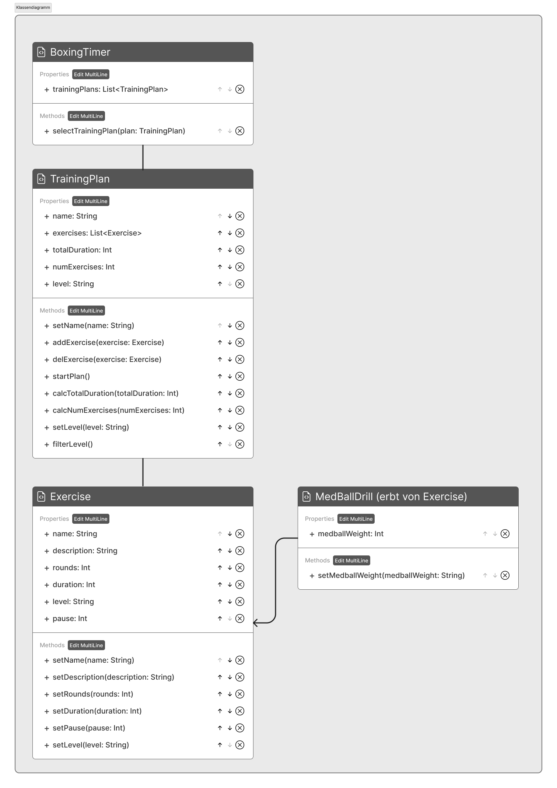

## Batch08 Grundlagen der Programmierung

# classes.BoxingTimer

Dieses Projekt enthält eine Boxing Timer-Anwendung mit verschiedenen Übungen und Schwierigkeitsgraden.

## Hauptklassen

### classes.BoxingTimer

Die Klasse classes.BoxingTimer verwaltet eine Liste von Trainingsplänen. Jeder dieser Pläne kann ausgewählt und ausgeführt werden.

- **Eigenschaften**:
  - `trainingPlans`: Eine Liste der zur Verfügung stehenden Trainingspläne.
- **Methoden**:
  - `selectTrainingplan(plan: TrainingPlan)`: Diese Methode ermöglicht die Auswahl eines bestimmten Trainingsplans aus der Liste der verfügbaren Pläne.

### TrainingPlan

Die Klasse TrainingPlan repräsentiert einen Trainingsplan, der aus einer Liste von Übungen besteht. Jeder Trainingsplan hat einen Namen, einen Schwierigkeitsgrad und speichert die Gesamtdauer sowie die Anzahl der Übungen.

- **Eigenschaften**:
  - `name`: Der Name des Trainingsplans.
  - `exercises`: Eine Liste der Übungen, die im Trainingsplan enthalten sind.
  - `totalDuration`: Die Gesamtdauer des Trainingsplans in Sekunden.
  - `numExercises`: Die Anzahl der Übungen im Trainingsplan.
  - `level`: Der Schwierigkeitsgrad des Trainingsplans.
- **Methoden**:
  - `setName(name: String)`: Legt den Namen des Trainingsplans fest.
  - `addExercise(exercise: Exercise)`: Fügt eine Übung zum Trainingsplan hinzu.
  - `delExercise(exercise: Exercise)`: Entfernt eine Übung aus dem Trainingsplan.
  - `startPlan()`: Diese Methode startet den Trainingsplan. Sie durchläuft jede Übung in der Liste `exercises`, startet einen Timer basierend auf der Dauer jeder Übung und gibt entsprechende Hinweise in der Konsole aus.
  - `calcTotalDuration()`: Diese Methode berechnet die Gesamtdauer des Trainingsplans.
  - `calcNumExercises()`: Diese Methode berechnet die Anzahl der Übungen im Trainingsplan.
  - `setLevel(level: String)`: Legt den Schwierigkeitsgrad des Trainingsplans fest.
  - `filterLevel()`: Filtert Übungen basierend auf dem festgelegten Schwierigkeitsgrad.

### Exercise

Die Klasse Exercise repräsentiert eine einzelne Übung. Jede Übung hat einen Namen, eine Beschreibung, eine Anzahl von Runden, eine Dauer, eine Pause und einen Schwierigkeitsgrad.

- **Eigenschaften**:
  - `name`: Der Name der Übung.
  - `description`: Eine Beschreibung der Übung.
  - `rounds`: Die Anzahl der Runden, die in der Übung durchgeführt werden sollen.
  - `duration`: Die Dauer jeder Runde in Sekunden.
  - `pause`: Die Dauer der Pause zwischen den Runden in Sekunden.
  - `level`: Der Schwierigkeitsgrad der Übung.
- **Methoden**:
  - `setName(name: String)`: Legt den Namen der Übung fest.
  - `setDescription(description: String)`: Legt die Beschreibung der Übung fest.
  - `setRounds(rounds: Int)`: Legt die Anzahl der Runden fest.
  - `setDuration(duration: Int)`: Legt die Dauer jeder Runde fest.
  - `setPause(pause: Int)`: Legt die Dauer der Pause zwischen den Runden fest.
  - `setLevel(level: String)`: Legt den Schwierigkeitsgrad der Übung fest.

### MedBallDrill

Die Klasse MedBallDrill ist eine spezielle Art von Übung, die von der Klasse Exercise erbt. Sie fügt die Eigenschaft "Gewicht des Medizinballs" hinzu, sodass die Größe des Medizinballs an den Schwierigkeitsgrad angepasst werden kann.

- **Eigenschaften**:
  - `medballWeight`: Das Gewicht des Medizinballs in Kilogramm.
- **Methoden**:
  - `setMedballWeight(medballWeight: Int)`: Legt das Gewicht des Medizinballs fest.