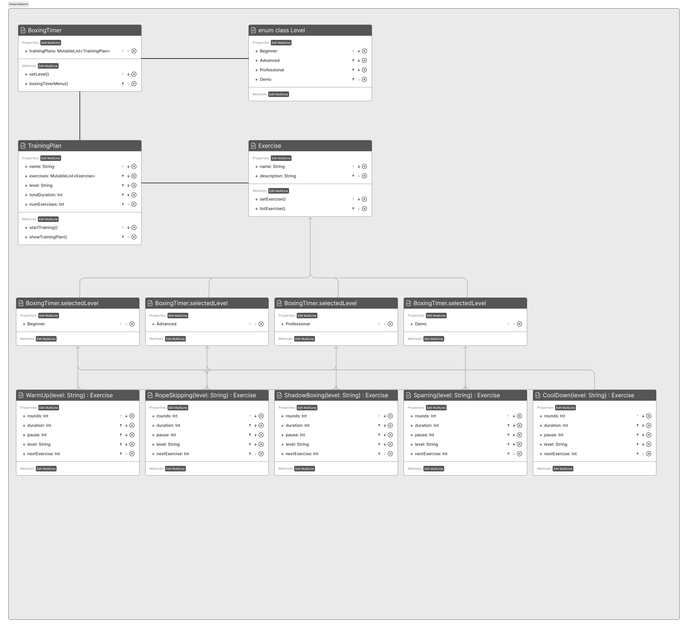

## Batch08 Programming basics

## Class diagram



# BoxingTimer Class

`BoxingTimer` is an open class used for organizing and controlling a boxing training program. It holds a list of `classes.TrainingPlan` objects, each representing an individual training classes.getPlan. Each `classes.TrainingPlan` contains a list of `classes.Exercise` objects, representing specific classes.getExercises within that training.

## Properties

- `trainingPlans`: A list of `classes.TrainingPlan` objects.

## Methods

- `setLevel()`: This method asks the user to select what level of training they would like to do and stores this information in the `selectedLevel` variable. This method is static and belongs to the companion object of the class.

- `boxingTimerMenu()`: This method displays a menu for the user to choose whether they want to see an overview of the classes.getExercises at their selected level, or whether they want to start their training. This method is also static and belongs to the companion object of the class.

## Companion Object

- The `companion object` contains static methods and properties that can be used independently of specific instances of `BoxingTimer`. The companion object contains the static `setLevel()` method which asks the user for their desired training level and stores the answer, and the static `boxingTimerMenu()` method which displays a menu and responds to user input.

The methods `listExercises()`, `showTrainingPlan()`, and `startTraining()` are called from the companion objects of the `classes.Exercise` and `classes.TrainingPlan` classes, suggesting that these classes are closely linked and work together to carry out the training plans.

Note that `selectedLevel` is stored within the `companion object` declaration, which means it is shared between different instances of `BoxingTimer`. If you want to use different `BoxingTimer` instances with different levels, you should store `selectedLevel` as a non-static property in the main class.

# classes.TrainingPlan Class

`classes.TrainingPlan` is a class used for managing individual training plans within a boxing training program.

## Properties

- `name`: A string representing the name of the training classes.getPlan.
- `classes.getExercises`: A list of `classes.Exercise` objects, each representing a specific exercise within the training classes.getPlan.
- `level`: A string representing the level of the training classes.getPlan.
- `totalDuration`: An integer representing the total duration of all classes.getExercises in the training classes.getPlan, in seconds.
- `minutes`: An integer representing the number of minutes in `totalDuration`.
- `seconds`: An integer representing the remaining number of seconds in `totalDuration` after `minutes` have been subtracted.
- `numExercises`: An integer representing the number of classes.getExercises in the training classes.getPlan.

## Methods

- `startTraining()`: This method controls the execution of the training classes.getPlan. It loops through each exercise in the classes.getPlan, and each round within the exercise, and performs a countdown for each one. After each exercise (except for the last one), it also performs a countdown for a break period. This method is static and belongs to the companion object of the class.

- `showTrainingPlan()`: This method prints a summary of the training classes.getPlan, including its name, total duration, and number of classes.getExercises. This method is also static and belongs to the companion object of the class.

## Companion Object

- The `companion object` contains static methods that can be used independently of specific instances of `classes.TrainingPlan`. The companion object contains the static `startTraining()` method which controls the execution of the training classes.getPlan, and the static `showTrainingPlan()` method which prints a summary of the training classes.getPlan.

## Usage

You can create an instance of `classes.TrainingPlan` by providing the name, a list of classes.getExercises, and the level. The `name` and `level` can be obtained from the `selectedLevel` property of the `BoxingTimer` class.

```kotlin
val classes.getPlan = classes.TrainingPlan(
    name = BoxingTimer.selectedLevel,
    classes.getExercises = classes.getExercises,
    level = BoxingTimer.selectedLevel
)
```

# classes.Exercise Class

`classes.Exercise` is a class used for managing individual classes.getExercises within a boxing training program.

## Properties

- `name`: A string representing the name of the exercise.
- `description`: A string representing the description of the exercise.
- `rounds`: An integer representing the number of rounds in the exercise.
- `duration`: An integer representing the duration of each round, in seconds.
- `pause`: An integer representing the duration of the pause after each round, in seconds.
- `level`: A string representing the level of the exercise.
- `nextExercise`: An integer representing the time until the start of the next exercise, in seconds.

## Methods

- `setExercises()`: This method adds predefined classes.getExercises to the `classes.getExercises` list. This method is static and belongs to the companion object of the class.

- `listExercises()`: This method prints a list of all classes.getExercises. This method is also static and belongs to the companion object of the class.

## Companion Object

- The `companion object` contains static methods that can be used independently of specific instances of `classes.Exercise`. The companion object contains the static `setExercises()` method which adds predefined classes.getExercises to the `classes.getExercises` list, and the static `listExercises()` method which prints a list of all classes.getExercises.

## Usage

You can create an instance of `classes.Exercise` by providing the name, description, number of rounds, duration of each round, duration of the pause after each round, level of the exercise, and the time until the start of the next exercise.

```kotlin
val classes.getWarmUp = WarmUp(BoxingTimer.selectedLevel)
val classes.getRopeSkipping = RopeSkipping(BoxingTimer.selectedLevel)
val classes.getShadowBoxing = ShadowBoxing(BoxingTimer.selectedLevel)
val classes.getSparring = Sparring(BoxingTimer.selectedLevel)
val classes.getCoolDown = CoolDown(BoxingTimer.selectedLevel)
```

# WarmUp Class

`WarmUp` is a subclass of `classes.Exercise`, which is specifically tailored for warm-up classes.getExercises.

## Properties

The properties of `WarmUp` are the same as those of the `classes.Exercise` class, including `name`, `description`, `rounds`, `duration`, `pause`, `level`, and `nextExercise`. The values for these properties are set when creating an instance of the `WarmUp` class based on the selected level, which is an argument provided when creating the instance.

## Constructors

The `WarmUp` class has a single constructor that accepts a `level` parameter. The `level` parameter determines the number of rounds, the duration of each round, the pause after each round, and the time until the start of the next exercise. Here's how the values are set based on the `level`:

- The `rounds` property is set to 1 for all levels.
- The `duration` property is set to 300 seconds for the "Beginner", "Advanced", "Professional" levels and 10 seconds for the "Demo" level.
- The `pause` property is set to 0 for all levels.
- The `level` property is set to the `selectedLevel` property of the `BoxingTimer` class.
- The `nextExercise` property is set to 60 seconds for the "Beginner", "Advanced", "Professional" levels and 10 seconds for the "Demo" level.

## Usage

You can create an instance of `WarmUp` by providing the level as an argument:

```kotlin
val classes.getWarmUp = WarmUp(BoxingTimer.selectedLevel)
```

# RopeSkipping Class

`RopeSkipping` is a subclass of `classes.Exercise`, specifically tailored for rope skipping classes.getExercises.

## Properties

The properties of `RopeSkipping` are the same as those of the `classes.Exercise` class, including `name`, `description`, `rounds`, `duration`, `pause`, `level`, and `nextExercise`. The values for these properties are set based on the selected level when creating an instance of the `RopeSkipping` class.

## Constructors

The `RopeSkipping` class has a single constructor that accepts a `level` parameter. The `level` parameter determines the number of rounds, the duration of each round, the pause after each round, and the time until the next exercise starts. Here's how the values are set based on the `level`:

- The `rounds` property is set to 3 for the "Beginner", "Advanced", "Professional" levels, 2 for the "Demo" level, and 1 as a default value.
- The `duration` property is set to 60 seconds for the "Beginner" level, 90 seconds for the "Advanced" level, 180 seconds for the "Professional" level, and 10 seconds for the "Demo" level and as a default value.
- The `pause` property is set to 60 seconds for the "Beginner", "Advanced", "Professional" levels, 5 seconds for the "Demo" level and as a default value.
- The `level` property is set to the passed `level` parameter.
- The `nextExercise` property is set to 60 seconds for the "Beginner", "Advanced", "Professional" levels, 10 seconds for the "Demo" level, and 60 seconds as a default value.

## Usage

You can create an instance of `RopeSkipping` by providing the level as an argument:

```kotlin
val classes.getRopeSkipping = RopeSkipping(level)
```

# ShadowBoxing Class

`ShadowBoxing` is a subclass of `classes.Exercise`, specifically designed for shadow-boxing classes.getExercises.

## Properties

The properties of `ShadowBoxing` are the same as those of the `classes.Exercise` class, including `name`, `description`, `rounds`, `duration`, `pause`, `level`, and `nextExercise`. The values for these properties are set based on the selected level when creating an instance of the `ShadowBoxing` class.

## Constructors

The `ShadowBoxing` class has a single constructor that accepts a `level` parameter. The `level` parameter determines the number of rounds, the duration of each round, the pause after each round, and the time until the next exercise starts. Here's how the values are set based on the `level`:

- The `rounds` property is set to 3 for the "Beginner", "Advanced", "Professional" levels, 2 for the "Demo" level, and 1 as a default value.
- The `duration` property is set to 60 seconds for the "Beginner" level, 120 seconds for the "Advanced" level, 180 seconds for the "Professional" level, and 10 seconds for the "Demo" level, and 120 seconds as a default value.
- The `pause` property is set to 60 seconds for the "Beginner" and "Advanced" levels, 30 seconds for the "Professional" level, 5 seconds for the "Demo" level and as a default value.
- The `level` property is set to the passed `level` parameter.
- The `nextExercise` property is set to 60 seconds for the "Beginner", "Advanced", "Professional" levels, 10 seconds for the "Demo" level, and 60 seconds as a default value.

## Usage

You can create an instance of `ShadowBoxing` by providing the level as an argument:

```kotlin
val classes.getShadowBoxing = ShadowBoxing(level)
```

# Sparring Class

`Sparring` is a subclass of `classes.Exercise`, specifically designed for classes.getSparring classes.getExercises.

## Properties

The properties of `Sparring` are the same as those of the `classes.Exercise` class, including `name`, `description`, `rounds`, `duration`, `pause`, `level`, and `nextExercise`. The values for these properties are set based on the selected level when creating an instance of the `Sparring` class.

## Constructors

The `Sparring` class has a single constructor that accepts a `level` parameter. The `level` parameter determines the number of rounds, the duration of each round, the pause after each round, and the time until the next exercise starts. Here's how the values are set based on the `level`:

- The `rounds` property is set to 3 for the "Beginner" level, 5 for the "Advanced" level, 6 for the "Professional" level, 2 for the "Demo" level, and 1 as a default value.
- The `duration` property is set to 180 seconds for the "Beginner", "Advanced", and "Professional" levels, 15 seconds for the "Demo" level, and 10 seconds as a default value.
- The `pause` property is set to 60 seconds for the "Beginner", "Advanced", and "Professional" levels, 5 seconds for the "Demo" level and 10 seconds as a default value.
- The `level` property is set to the passed `level` parameter.
- The `nextExercise` property is set to 60 seconds for the "Beginner", "Advanced", "Professional" levels, 10 seconds for the "Demo" level, and 60 seconds as a default value.

## Usage

You can create an instance of `Sparring` by providing the level as an argument:

```kotlin
val classes.getSparring = Sparring(level)
```

# CoolDown Class

`CoolDown` is a subclass of `classes.Exercise`, specifically designed for cool-down classes.getExercises.

## Properties

The properties of `CoolDown` are the same as those of the `classes.Exercise` class, including `name`, `description`, `rounds`, `duration`, `pause`, `level`, and `nextExercise`. The values for these properties are set based on the selected level when creating an instance of the `CoolDown` class.

## Constructors

The `CoolDown` class has a single constructor that accepts a `level` parameter. The `level` parameter determines the number of rounds, the duration of each round, the pause after each round, and the time until the next exercise starts. Here's how the values are set based on the `level`:

- The `rounds` property is set to 1 for all levels including the "Beginner", "Advanced", "Professional", and "Demo" levels, and also as a default value.
- The `duration` property is set to 600 seconds for the "Beginner", "Advanced", and "Professional" levels, 10 seconds for the "Demo" level, and 10 seconds as a default value.
- The `pause` property is set to 0 for all levels including the "Beginner", "Advanced", "Professional", and "Demo" levels, and also as a default value.
- The `level` property is set to the passed `level` parameter.
- The `nextExercise` property is set to 0 as the cool-down is always the last exercise in the routine.

## Usage

You can create an instance of `CoolDown` by providing the level as an argument:

```kotlin
val classes.getCoolDown = CoolDown(level)
```

`The classes description is generated with ChatGPT`


